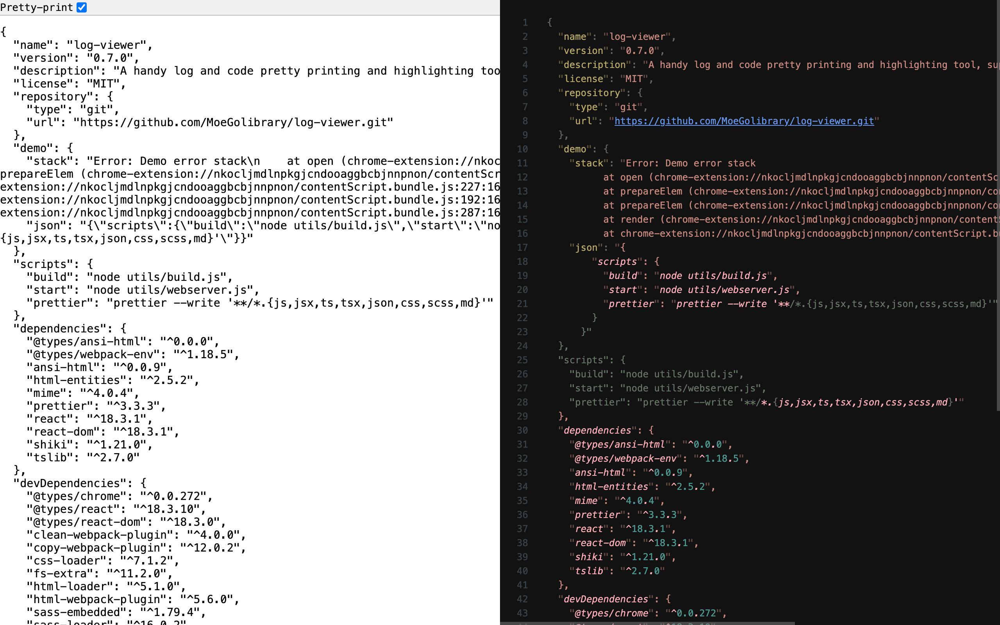

# Log Viewer

## Highlights

- Pretty and highlight print all text formats, including JSON, ANSI, HTML.
- Auto wrap new lines in JSON string.
- Supports text selection, element selection, clipboard.
- Quick access with [shortcuts](#shortcuts).
- [Auto format](#automation) page.

## Install

1. Download the zip file from release.
2. Unzip it to a directory.
3. Enable developer mode in <chrome://extensions>.
4. Load the directory with Load unpacked button.

## Shawcase



## Usage

### Shortcuts

- `vv`: pretty print json, auto break lines in string, read from selection or current dom node.
- `pp`: pretty print json, read from clipboard.
- `cc`: pretty print current page's source code with prettier & shiki.
- `hh`: pretty print current page's current html with monaco & shiki.
- `xx`: pretty print current page's text content with ansi colors.

### Context menu

Log Viewer also has options to trigger shortcuts in context menu `Log Viewer`, except for `pp`.

### Automation

Log Viewer will auto open (trigger `cc` shortcut) if the current page's content type is resource, e.g., yaml, js, css.

Note: there is no option to disable it at this moment.

## Dev

1. Clone the repo:

    ```bash
    git clone https://github.com/MoeGolibrary/log-viewer.git
    ```

2. Install dependencies:

    ````bash
    pnpm i
    ````

3. Start dev server:

    ```bash
    pnpm start
    ```

4. Build

   ```bash
   pnpm build
   # or, generate all
   ./build.sh
   ```
