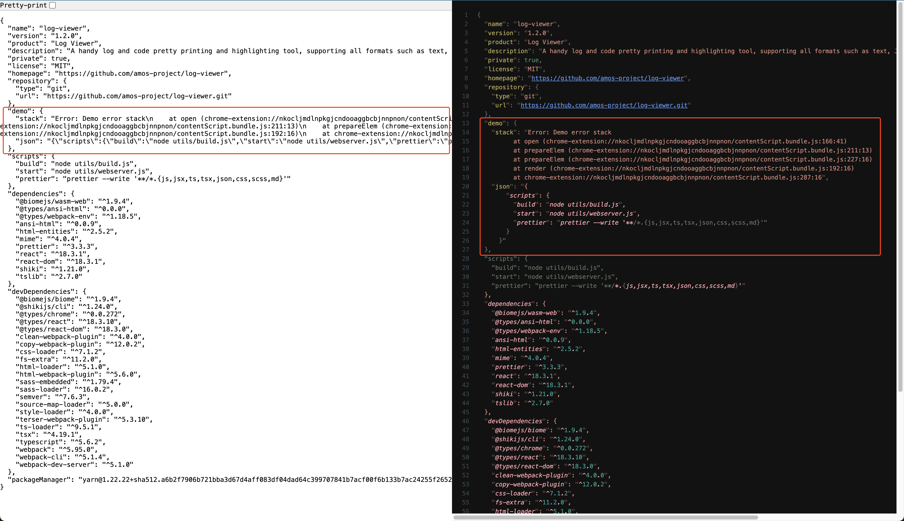
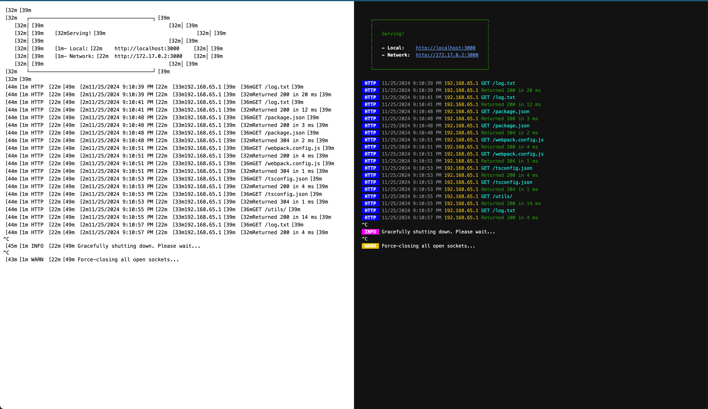
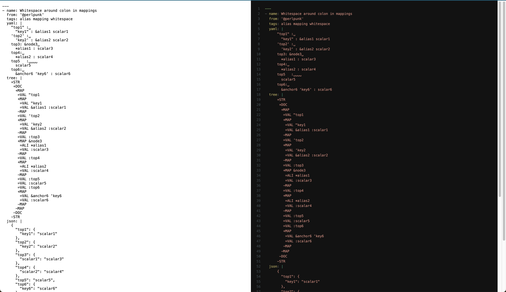

# Log Viewer

Log Viewer is a handy tool to help you read logs happily in your browser, especially error logs. It also supports common
code formatting and highlighting, such as XML, YAML, etc., especially supports **ANSI** formatting.

## Highlights

- Customized JSON formatting scheme, allowing you to clearly read JSON formatted error logs, especially call stack
  information.
- Format and highlight almost any text format, such as JSON, ANSI, HTML, YAML, etc.
- Supports text selection, element selection, clipboard.
- Quick access with [shortcuts](#shortcuts).
- [Auto format](#automation) page.

## Install

[](https://chromewebstore.google.com/detail/log-viewer/lbnkfmnolbefifdccejjijdgdipnfaib)

## Showcase

<details open>
<summary>Pretty JSON</summary>



</details>

<details>
<summary>Pretty ANSI</summary>



</details>

<details>
<summary>Pretty YAML</summary>



</details>

## Usage

### Shortcuts

- `vv`: pretty print json, read from selection or current hovered dom node.
- `pp`: pretty print json, read from clipboard.
- `cc`: pretty print current page's source code, auto detect content type.
- `hh`: pretty print current page's current html.
- `xx`: pretty print current page's text content with ansi colors.
- `ff`: toggle full screen mode.
- `Esc`: exit log viewer.

### Context menu

Log Viewer also has options to trigger shortcuts in context menu `Log Viewer`, except for `pp`.

### Automation

Log Viewer will auto open (trigger `cc` shortcut) if the current page's content type is resource, e.g., yaml, js, css.

Note: there is no option to disable it at this moment.

## Dev

1. Clone the repo:

    ```bash
    git clone https://github.com/amos-project/log-viewer.git
    ```

2. Install dependencies:

    ````bash
    yarn i
    ````

3. Start dev server:

    ```bash
    yarn start
    ```

4. Build

   ```bash
   yarn build
   # or, generate all
   ./build.sh
   ```
